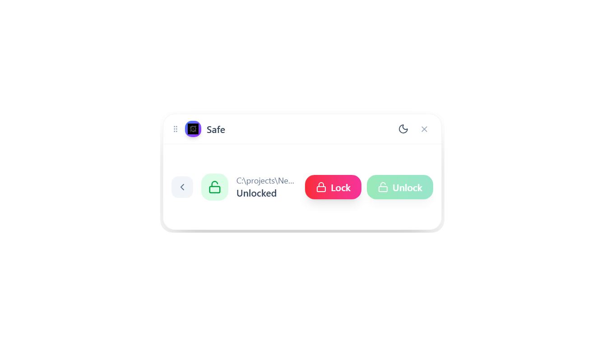
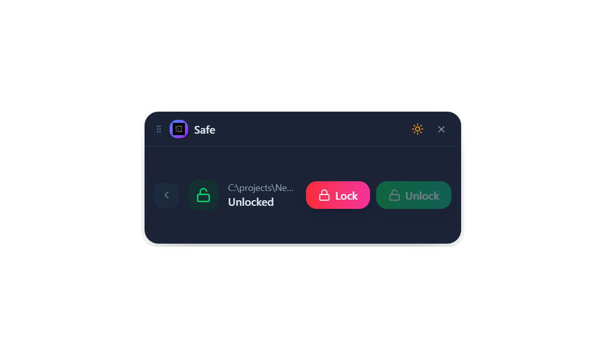

<div align="center">

# 🔐 Safe


**A beautiful, minimal desktop widget for encrypting and decrypting your files with military-grade AES-256 encryption.**

[](https://choosealicense.com/licenses/mit/)
[](https://tauri.app/)
[](https://react.dev/)

</div>

---

## ✨ Features

- 🔒 **AES-256 Encryption** — Military-grade encryption for your files
- 🎨 **Dark/Light Theme** — Beautiful UI with theme toggle
- 🪟 **Widget Design** — Compact, always-on-top overlay
- ⚡ **Fast & Native** — Built with Rust and Tauri
- 🖱️ **Drag & Drop** — Frameless, draggable window
- 🔑 **Password Protected** — Your password is your key

---

## 📸 Screenshots

<!-- Add your screenshots in a /screenshots folder -->



> **📍 Add screenshots:** Create a `screenshots` folder in the project root and add your images there.

---

## 🚀 Quick Start

### Prerequisites

- [Node.js](https://nodejs.org/) (v18+)
- [Rust](https://rustup.rs/)
- [Tauri CLI](https://tauri.app/v1/guides/getting-started/prerequisites)

### Installation

```bash
# Clone the repository
git clone https://github.com/malikhuzaifabinahmed/Safe.git
cd Safe

# Install dependencies
npm install

# Run in development mode
npm run tauri dev

# Build for production
npm run tauri build
```

---

## 📖 Usage

### 1️⃣ Enter Safe Path
Type the path to the folder you want to encrypt:
```
C:\Users\YourName\Documents\MySafe
```

### 2️⃣ Enter Password
Choose a strong password — this is your encryption key!

### 3️⃣ Lock or Unlock

| Action | Description |
|--------|-------------|
| 🔒 **Lock** | Encrypts all files in the directory |
| 🔓 **Unlock** | Decrypts all files with your password |

> ⚠️ **Important:** Remember your password! Without it, encrypted files cannot be recovered.

---

## 🛠️ Tech Stack

| Technology | Purpose |
|------------|---------|
| [Tauri 2.0](https://tauri.app/) | Desktop framework |
| [React 19](https://react.dev/) | UI library |
| [TypeScript](https://www.typescriptlang.org/) | Type safety |
| [Tailwind CSS](https://tailwindcss.com/) | Styling |
| [Rust](https://www.rust-lang.org/) | Backend encryption |
| [shadcn/ui](https://ui.shadcn.com/) | UI components |

---

## 🤝 Contributing

Contributions are welcome! Here's how you can help:

1. **Fork** the repository
2. **Create** a feature branch (`git checkout -b feature/amazing-feature`)
3. **Commit** your changes (`git commit -m 'Add amazing feature'`)
4. **Push** to the branch (`git push origin feature/amazing-feature`)
5. **Open** a Pull Request

### Development Setup

```bash
# Install dependencies
npm install

# Run development server
npm run tauri dev

# Format code
npm run format

# Build for production
npm run tauri build
```

---

## 📁 Project Structure

```
Safe/
├── src/                    # React frontend
│   ├── components/         # UI components
│   │   ├── SafeWidget.tsx  # Main widget component
│   │   ├── theme-provider.tsx
│   │   └── theme-toggle.tsx
│   ├── App.tsx
│   └── global.css
├── src-tauri/              # Rust backend
│   ├── src/
│   │   ├── lib.rs          # Encryption logic
│   │   └── main.rs
│   └── tauri.conf.json     # Tauri configuration
└── README.md
```

---

## 📄 License

This project is licensed under the **MIT License** — see the [LICENSE](LICENSE) file for details.

---

## 👤 Author

**Malik Huzaifa Bin Ahmed**

- GitHub: [@malikhuzaifabinahmed](https://github.com/malikhuzaifabinahmed)

---

<div align="center">

**⭐ Star this repo if you find it useful!**

Made with ❤️ using Tauri + React

</div>
